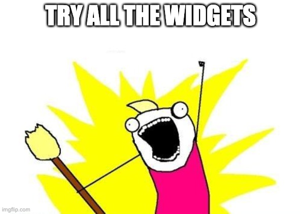
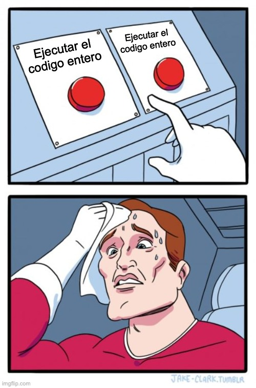
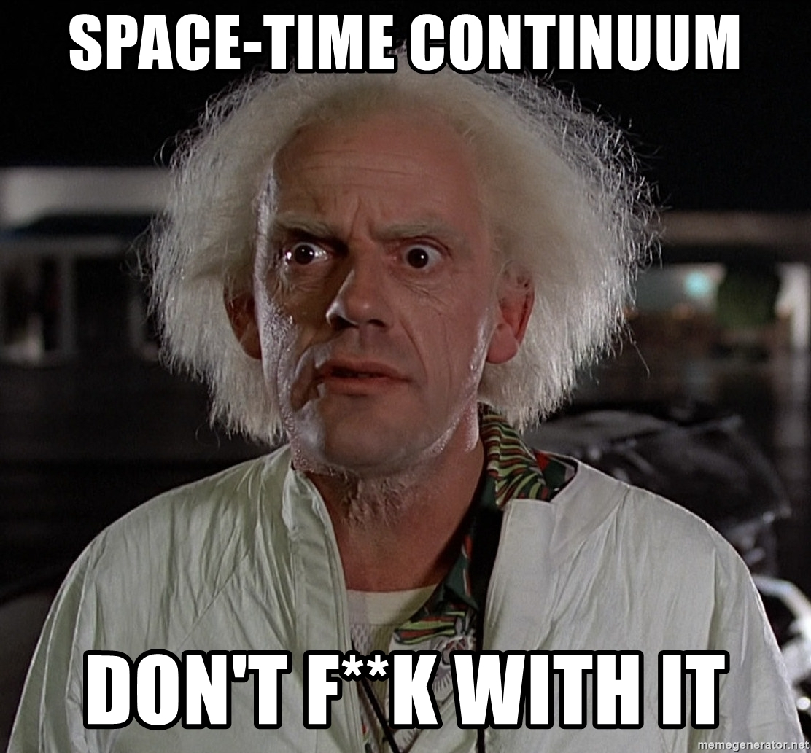
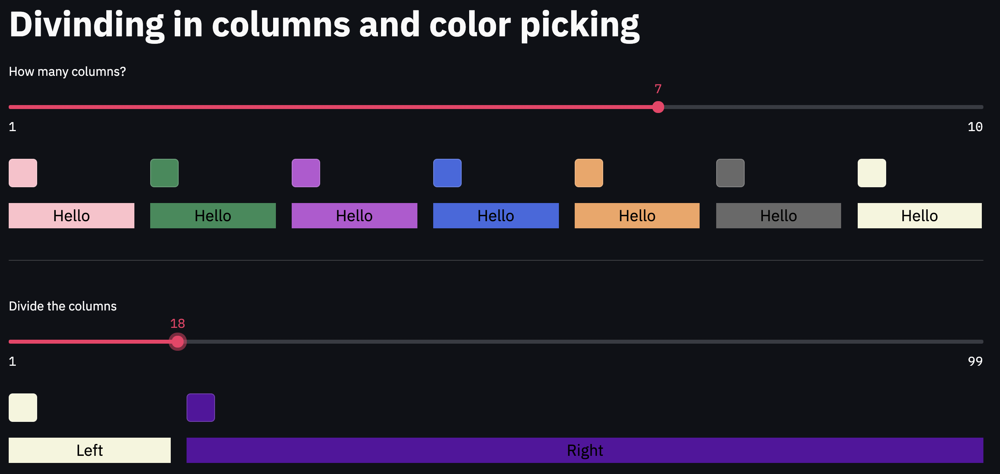
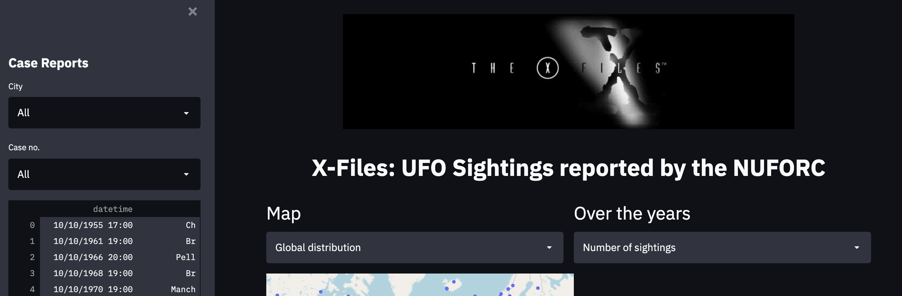

# Crea web apps y dashboards de visualización de datos en Python
[`Streamlit`](https://streamlit.io/) es un framework para desarollo de web apps en Python, sin necesidad de conocimientos de front-end, y que te permite crear una aplicación en horas, no en semanas.

Originalmente pensado para visuzalización de datos y modelos de machine learning, la libreria tiene una serie de herramientas muy versátiles que te permitiran hacer eso y mucho más.

La creatividad es el limite y el despliegue a la nube está a un paso de distáncia.

## Empezando
Para iniciar nuestra jornada con streamlit, necesitamos apenas instalar la libreria usando `PIP`. 

> Nota: Actualmente streamlit tiene soporte para python versiones entre 3.6 y 3.8.

Crea tu nuevo entorno virtual para ese proyecto y instala `streamlit`:

```
pip install streamlit
```

Una vez instalado, para ver algunos ejemplos de lo que se puede hacer, ejecutamos:

```
streamlit hello
```

Además de esos demos, la pagina oficial también contiene una galeria curada con muchos ejemplos muy guays: [Streamlit Gallery](https://streamlit.io/gallery)

## Ponlo en marcha
No nos basta ver los ejemplos, queremos hacer nuestro proprio! Creamos un fichero `app.py` y importamos streamlit, por convención con un alias:

```python
import streamlit as st
```

Con nada más que eso, ya podemos ejecutar la app. Por la terminal, emitimos el siguiente comando:

```
streamlit run app.py
```

A partir de ese momento, no hay más que preocuparse con la ejecución. Cualquier cambio que guardemos en `app.py` pueden ser vistos con refrescar el navegador. 

Con eso solo nos resta empezar a construir!

## Lego Bricks


El desarollo de una web app con `streamlit` funciona como la construción con bloques de lego, donde vamos combinar diferentes bloques, llamados `widgets`, con diferentes propriedades y funciones.

Esos widgets seran los instrumentos que nos permitiran representar información, como textos, imagenes, graficos, mapas, videos, etc. y también interactuar con la aplicación, con inputs de texto, selectores y multiselectores, sliders, calendarios, etc.

Para poner la piedra angular de nueustra app, simplemente llamamos a la función correspondiente, por ejemplo un titular:

```python
st.title("My first Streamlit app")
```

Guardamos los cambios, refrescamos el navegador y boom goes the dynamite! 🤯

¡Ojo! No tuvimos que decirle la posición, tamaño, estilo, nada! Solo la frase que queríamos y ¡ya está! 

¡Vamos a por más! ¿Que widgets hay?



El equipo de `streamlit`, además de una documentación bastante clara, nos há preparado un [cheat sheet](https://share.streamlit.io/daniellewisdl/streamlit-cheat-sheet/app.py) con todos las funciones disponibles para fácil consulta.

Probemos un interactivo, un input de texto.

```python
st.text_input('Tell me your name')
```

F5, F5, F5 y ahí tenemos la cajita de texto, podemos escribir en ella y todo. ¿Pero como podemos guardar ese dato para usar?

Pues los creadores de streamlit nos lo han puesto como a _Felipe II_, resulta que si cambiamos un pelín la linea de codigo anterior:

```python
user_name = st.text_input('Tell me your name')
```

A la vez estaremos colocando el widget y almacenando el valor _inputado_ en una variable cuando se le use. Si añadimos un `print(user_name)`. Poderemos ver en la terminal los diferentes valores que se guardan en esa variable segun utilizamos el `text_input`.

Veamos como podemos utilizar esas variables para cambiar lo que se ve en la web app. Prueba el siguiente codigo, disponible en `examples/luck.py`:

```python
import streamlit as st
from random import choice

st.title("Magic 8 Ball")

user_name = st.text_input('Tell me your name...')
button_press = st.button("Try your luck")

phrases = ["As I see it, yes.",
           "Ask again later.",
           "Better not tell you now.",
           "Cannot predict now.",
           "Concentrate and ask again.",
           "Don’t count on it.",
           "It is certain.",
           "It is decidedly so.",
           "Most likely.",
           "My reply is no.",
           "My sources say no.",
           "Outlook not so good.",
           "Outlook good.",
           "Reply hazy, try again.",
           "Signs point to yes.",
           "Very doubtful.",
           "Without a doubt.",
           "Yes.",
           "Yes – definitely.",
           "You may rely on it"]

if button_press:
    st.header(f"Let's see, {user_name}...")
    st.title(choice(phrases))
```

¿Puedes ver como funcionará la web app? Aqui guardamos dos informaciones:

- `user_name` : el string conteniendo lo que escribió el usuario, o un string vacio caso no haya escrito nada.
- `button_press` : Un booleano que será `False` por defecto y solo se convertirá en `True` cuando pulsado. En ese caso, utilizamos ese botón para iniciar una acción que es representar el mensaje al usuario y la suerte aleatória. 

# Flujo de ejecución
Con lo que ya probamos hasta el momento, podemos notar que hay una manera muy particular en la que se interpreta el codigo python al usar streamlit.

`Atención a lo siguiente:`

- El codigo de la web app se ejecuta `entero`, ¡desde el princípio hasta el final!
- En la primera ejecución (cuando se carga la web app en el navegador), todas las variables que contienen datos de widgets tendrán su valor por defecto.
- La interacción con cualquier widget hará que:
    - La variable correspondiente tenga el nuevo valor
    - El codigo vuelva a ejecutarse `entero`, ¡desde el princípio hasta el final!

`En otras palabras:`
- El codigo siempre se ejecutará `entero`, ¡desde el princípio hasta el final! `*`
- El unico cambio entre cada ejecución es el valor almacenado en las variables relacionadas a inputs.

`*` Hay una excepción, como en toda regla, que es el uso de la función: `st.stop()`. 



## El problema de la continuidad
Ese paradigma de funcionamento de `python` y `streamlit` parece presentarnos una limitación, ¿no?

Un widget de input siempre tiene que venir **antes** de cualquier representación que utilice su valor.

Y el **antes**, por la naturaleza secuencial de la construción de streamlit significa espacialmente encima. O sea, el controlador nunca poderia estar debajo de la grafica que controla, por ejemplo, en la diagramación de una web app.

Pero ese problema ha sido previsto por el equipo desarollador y hay una solución muy sencilla para eso.

- No pintaremos la representación, apenas marcaremos el lugar donde estará, i.e.: reservamos el hueco.
- Ponemos el widget de input
- Sustituimos la reserva por la representación en si.

Ese elemento _reservador_, o mas bien `placeholder` es el de la función

```python
st.empty()
```

Ese elemento, debemos guardarlo en una variable para en seguida sustituirle por el objeto definitivo, usando la sintaxis `placeholder.<widget>`. Miremos el ejemplo:

```python
title = st.empty()
page_title = st.text_input('What should the title be?')
title.title(page_title)
```

De esa manera conseguimos que el titulo cambie en cima de la cajita de input del texto y no rompemos ninguna ley del continuo espacio-temporal.



## Getting fancy
Bueno, con lo que hemos visto hasta ahora y logica de programación python, ya tenemos todo el basico para crear diferentes web apps.

Pero para tener mas gustillo y dar más libertad a la imaginación, aprenderemos a poner dos objetos (bloquitos de lego) lado a lado, en lugar de encima abajo.

Para hacer eso, dividiremos la fila donde pondríamos el siguiente widget en columnas.

### n columnas

```python
columns = st.beta_columns(2)
```

Y maravilla, ya tenemos las dos columnas `columns` para poner en ellas lo que queramos. Y eso se puede hacer de dos maneras diferentes, representadas abajo:

#### Metodo de la columna

```python
columns[0].write("Left column.")
columns[1].write("Right column.")
```

#### Con with
```python
with columns[0]:
    st.write("Left column.")
with columns[1]:
    st.write("Right column.")
```

### Columnas proporcionales

Otra manera de dividir las columnas es proporcionalmente, usando unidades imaginarias y pasando el tamaño de cada columna como una tupla.

Si queremos 3 columnas ocupando:
- La primera mitad del espacio
- La segunda y tercera 1/4, podemos hacer:

```python
columns = st.beta_columns((2,1,1))
```

Explora la division en columnas y el codigo ejecutando `/examples/columns.py` con streamlit. El selector de colores está incluído de bonus. 😉



## Sidebar

¡Hay un otro espacio disponible para añadir información y widgets cuando creamos una webapp!

Es la barra lateral, sidebar. Para incluir cualquier cosa en ella, simplesmente debemos incluir el nombre `sidebar` en los comandos.

```python
st.sidebar.title("This is the sidebar")
st.sidebar.image("sidebar_banner.png")
```

## Compatibilidad

No tendríamos todo si no pudieramos también añadir diferentes visualizaciones de datos en nuestra web app y otras herramientas de datos.

Streamlit tiene una [serie de funciones](https://docs.streamlit.io/en/stable/api.html#display-charts) basicas para representar graficas usando matplotlib.

Pero para mayor liberdad, streamlit tiene compatibilidad com las más importantes librerias de data y Machine Learning en python:


# Poniendole en practica

Ahora vamos utilizar todas esas herramientas para crear una web app entera. Y te toca investigar el codigo, disponible en `x_files.py`. Don't worry, el codigo está enteramente comentado para guiarte.

Puedes ejecutar directamente con
```
streamlit run x_files.py
```

Igualmente, puedes visitar la app en [X-Files Heroku](https://x-files-core.herokuapp.com/).



# Despliegue fácil y simple

Ademas de generar facilmente una webapp, es muy fácil desplegarla a la nube subiendola a un servicio como [Heroku](heroku.com). Tenemos que preparar 4 ficheros muy sencillos y ya está listo para subir. Esos son los ficheros:

## runtime.txt
Ese fichero es el que dirá cual version de python Heroku tiene que instalar. No es necesario en todos proyectos, pero como streamlit no está compatible con las versiones más modernas todavía, simplemente escribimos la versión que usamos, en el caso de X-files:

```
python-3.7.10
```

## requirements.txt
Aqui es donde definimos las librerias que vamos a necesitar para que el programa funcione. Pandas, sklearn, seaborn, etc. Todas las librerias que uses tienen que reflejarse aqui.

```
watchdog==2.0.3
streamlit==0.81.0
pandas==1.2.4
plotly==4.14.3
```

## setup.sh
Para que streamlit funcione es necesaria una configuración, que és lo que hará ese fichero. Sobretodo configurará el puerto que se usará para la app y necesitamos del puerto que Heroku nos dá en una variable de entorno `$PORT`.

```bash
mkdir -p ~/.streamlit/
echo "\
[server]\n\
headless = true\n\
port = $PORT\n\
enableCORS = false\n\
\n\
" > ~/.streamlit/config.toml
```

## Procfile
Ese fichero es para poder desplegar nuestra app en [`Deis`](https://docs.teamhephy.com/), la plataforma `Kubernete` que usa Heroku.

```
web: sh setup.sh && streamlit run x_files.py
```

Se define que es una aplicación web y se configuran los dos comandos que necesitamos ejecutar, el de setup y nuesta app. 

El importante en ese comando es que definamos bien el nombre de nuestra app. En ese caso `x_files.py`.

## Subiendo la app
Cuando esté todo listo, web app funcionando y ficheros de configuración, necesitamos hacer que nuestro proyecto sea un repo `git`, con todo lo necesario `commiteado`.

Creamos una cuenta en `Heroku` y instalamos el Heroku-cli.

Por la terminal, hacemos el login:

```bash
heroku login
```

Por ultimo, subimos a heroku nuestro codigo como lo subiriamos a github. 

```bash
git push heroku master
```

¡Y listo!

# Have Fun and Keep Coding!